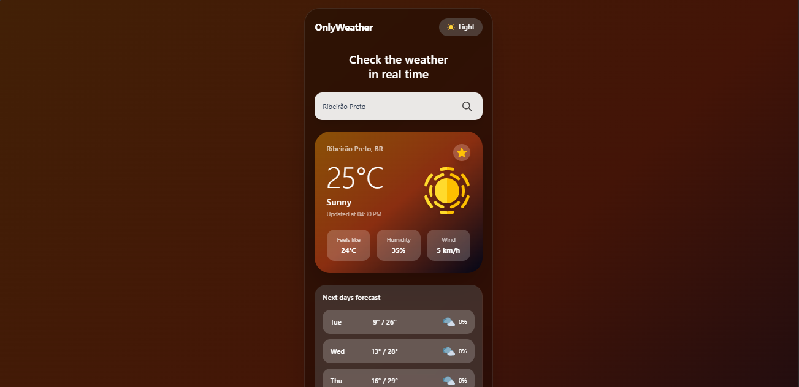
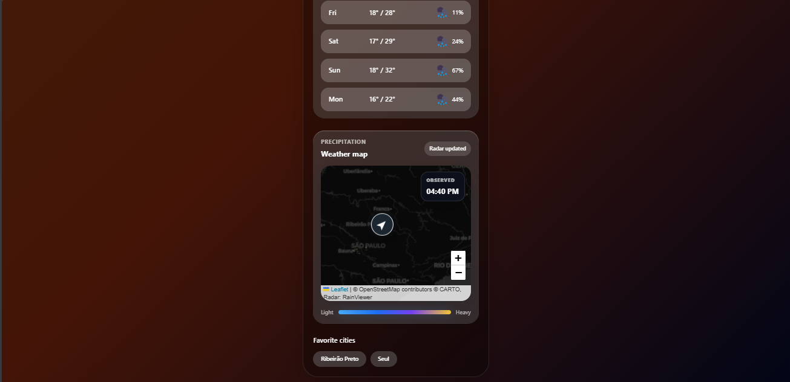

# OnlyWeather

OnlyWeather é uma aplicação full-stack de clima em tempo real, feita com Angular, Tailwind CSS e Java Spring Boot.

O app permite pesquisar uma cidade, consultar dados reais de clima, visualizar previsão dos próximos dias, alternar entre tema claro e escuro, favoritar cidades e acompanhar um mapa meteorológico com camada de precipitação.

## Preview

 

## Funcionalidades

- Busca de clima por cidade.
- Dados reais vindos da Open-Meteo API.
- Temperatura atual, sensação térmica, umidade e vento.
- Previsão dos próximos dias com chance de chuva.
- Ícones SVG dinâmicos para clima diurno e noturno.
- Tema claro e escuro.
- Cores dinâmicas de acordo com o clima atual.
- Cidades favoritas salvas no navegador.
- Mapa interativo com Leaflet.
- Camada visual de precipitação/radar via RainViewer.
- Mapa centralizado na localização da cidade pesquisada.
- Interface mobile-first.
- Back-end próprio em Spring Boot para tratar e organizar os dados.

## Tecnologias

### Front-end

- Angular 17
- TypeScript
- Tailwind CSS
- Leaflet
- RxJS
- LocalStorage

### Back-end

- Java 21
- Spring Boot
- Maven Wrapper
- Spring Web MVC
- Bean Validation
- RestTemplate

### APIs externas

- Open-Meteo Geocoding API
- Open-Meteo Forecast API
- RainViewer Weather Maps API

## Arquitetura

```txt
Usuário
  -> Angular
  -> Spring Boot API
  -> Open-Meteo
```

O front-end não consulta a Open-Meteo diretamente. Ele chama a API Java, que busca a cidade, obtém latitude e longitude, consulta a previsão e devolve uma resposta já formatada para a interface.

O mapa usa Leaflet no front-end e consome tiles de mapa/radar separadamente.

## Estrutura Principal

```txt
OnlyWeather/
  README.md
  docs/
  onlyweather-api/
    pom.xml
    mvnw
    mvnw.cmd
    src/main/java/com/onlyweather/api/
      client/
      config/
      controller/
      dto/
      exception/
      service/
  onlyweather-frontend/
    package.json
    angular.json
    tailwind.config.js
    src/
      app/
        core/services/weather.service.ts
        features/weather-map/
        features/sun-cycle/
        pages/home/
      assets/
        icons/
        weather-icons/
```

> Observação: o repositório também possui uma árvore Angular na raiz (`src/`, `package.json`, `angular.json`). O app principal usado no fluxo full-stack atual fica em `onlyweather-frontend/`.

## Endpoints

### Health check

```txt
GET /api/health
```

### Clima por cidade

```txt
GET /api/weather?city=Ribeirao Preto
```

Exemplo local:

```txt
http://localhost:8080/api/weather?city=Ribeirao%20Preto
```

Exemplo de resposta:

```json
{
  "cityName": "Ribeirão Preto",
  "country": "Brazil",
  "countryCode": "BR",
  "latitude": -21.1775,
  "longitude": -47.8103,
  "temperature": 26,
  "feelsLike": 25,
  "humidity": 34,
  "windSpeed": 3,
  "condition": "Sunny",
  "weatherType": "sunny",
  "icon": "assets/weather-icons/sunny.svg",
  "updatedAt": "2026-05-12T15:30",
  "forecast": [
    {
      "day": "Tue",
      "date": "2026-05-12",
      "minTemperature": 18,
      "maxTemperature": 29,
      "rainChance": 13,
      "condition": "Sunny",
      "weatherType": "sunny",
      "icon": "assets/weather-icons/sunny.svg"
    }
  ]
}
```

## Estados Visuais

O back-end traduz os códigos meteorológicos da Open-Meteo para tipos visuais usados pelo Angular:

- `sunny`
- `partly-cloudy`
- `cloudy`
- `rainy`
- `heavy-rain`
- `night`
- `rainy-night`
- `stormy-night`

Cada estado possui ícone próprio em `assets/weather-icons/` e tema visual correspondente no card principal.

## Como Rodar

### Pré-requisitos

- Node.js
- npm
- Java 21

### Back-end

Em um terminal:

```bash
cd onlyweather-api
```

No Windows:

```bash
.\mvnw.cmd spring-boot:run
```

No Linux/macOS:

```bash
./mvnw spring-boot:run
```

A API fica disponível em:

```txt
http://localhost:8080
```

### Front-end

Em outro terminal:

```bash
cd onlyweather-frontend
npm install
npm start
```

A aplicação fica disponível em:

```txt
http://localhost:4200
```

## Configuração da API no Front-end

O endereço da API fica em:

```txt
onlyweather-frontend/src/environments/environment.ts
```

Para desenvolvimento local, use:

```ts
export const environment = {
  production: false,
  apiUrl: 'http://localhost:8080/api'
};
```

Se estiver usando Dev Tunnels ou outro host, troque apenas o valor de `apiUrl`.

## Comandos Úteis

### Build do front-end

```bash
cd onlyweather-frontend
npm run build
```

### Testes do back-end

```bash
cd onlyweather-api
.\mvnw.cmd test
```

No Linux/macOS:

```bash
./mvnw test
```

## Dados Locais

O app usa `localStorage` para salvar preferências no navegador:

```txt
onlyweather-theme
onlyweather-favorite-cities
```

Não há login, cadastro ou banco de dados. As cidades favoritas ficam salvas apenas no navegador usado.

## Status

Implementado:

- Front-end Angular mobile-first.
- Back-end Spring Boot.
- Endpoint `/api/weather`.
- Endpoint `/api/health`.
- Integração com Open-Meteo.
- Mapeamento de clima diurno e noturno.
- Ícones SVG por condição climática.
- Tema claro/escuro.
- Favoritos no `localStorage`.
- Mapa Leaflet com radar de precipitação.
- Centralização do mapa pela cidade pesquisada.
- CORS configurado para desenvolvimento.

Em evolução:

- Componente de ciclo solar.
- Melhor cobertura de testes.
- Tratamento visual de loading e erros.
- Deploy do front-end e do back-end.
- Limpeza da árvore Angular duplicada na raiz.

## Autor

Desenvolvido por Thiago Barbosa Candido.
